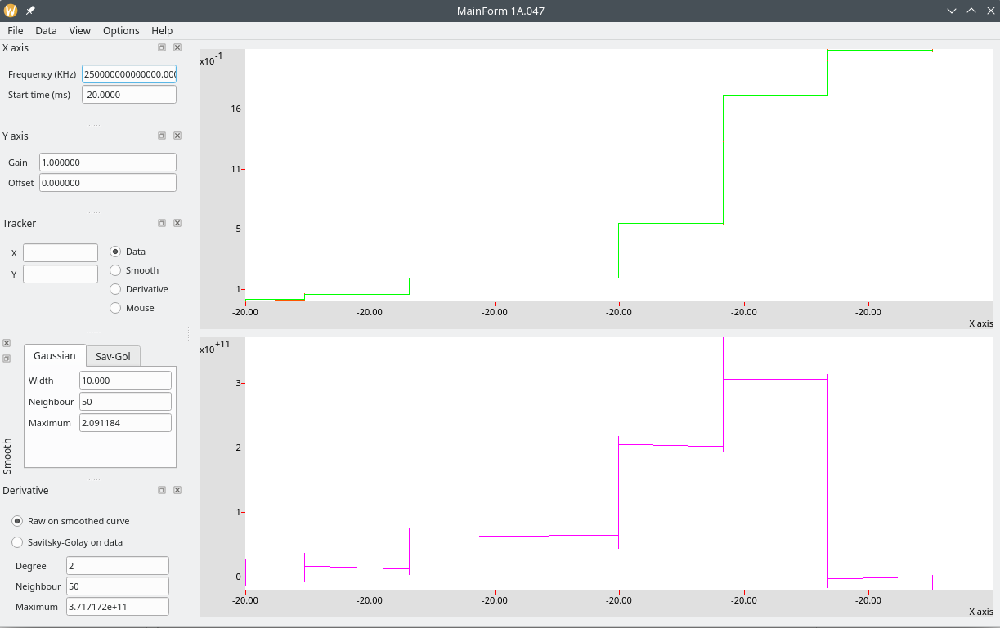
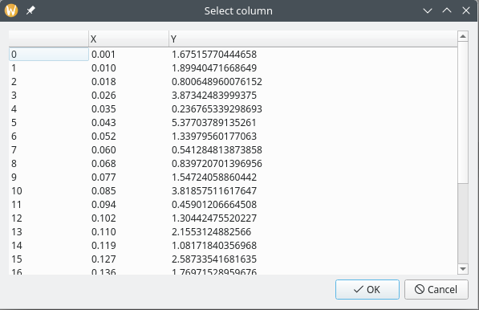

This simple program loads a csv file or a binary file and displays the X-Y data.

It can smooth the curve and compute the derivative.

A column selector is displayed if more than two columns are found in the csv file.

# Build

This application is based on [Qt](https://www.qt.io/).

It can be build with [Qt Creator](https://www.qt.io/development/download).
